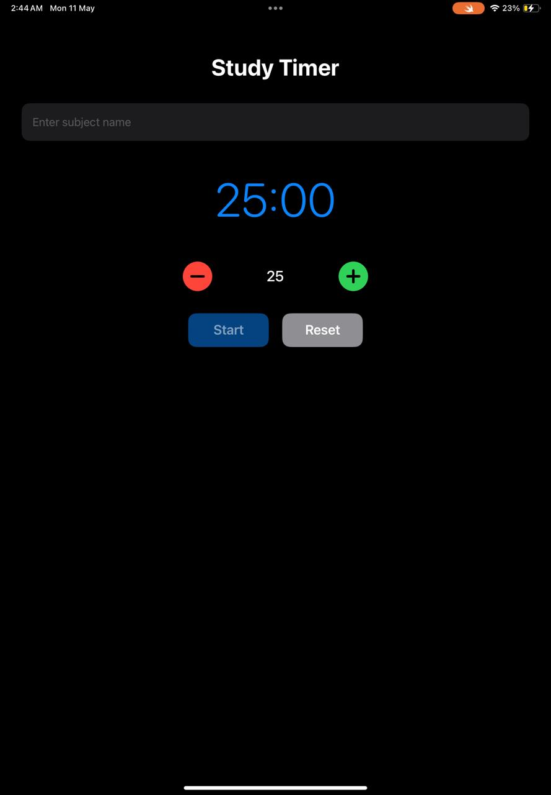
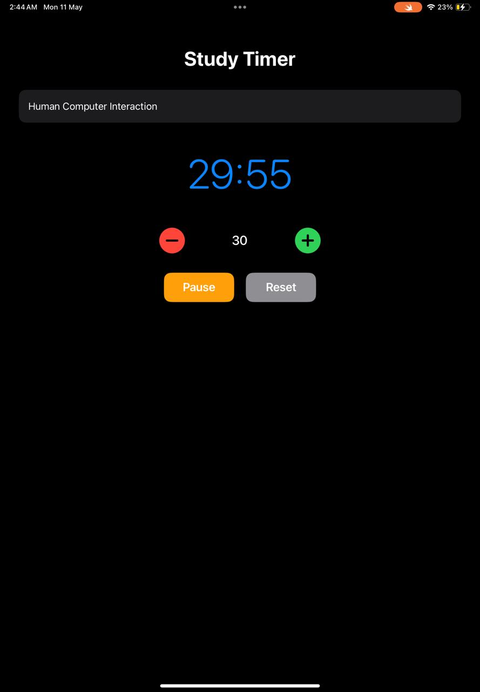

# Study Timer

A simple and clean SwiftUI application designed to help students stay focused while studying.

## Features
- Start and pause timer
- Reset study session
- Adjust study duration
- Minimal dark mode UI
- User-friendly design

## Built With
- Swift
- SwiftUI

## Screenshots

## Author
Khulud Bin Rubayan
